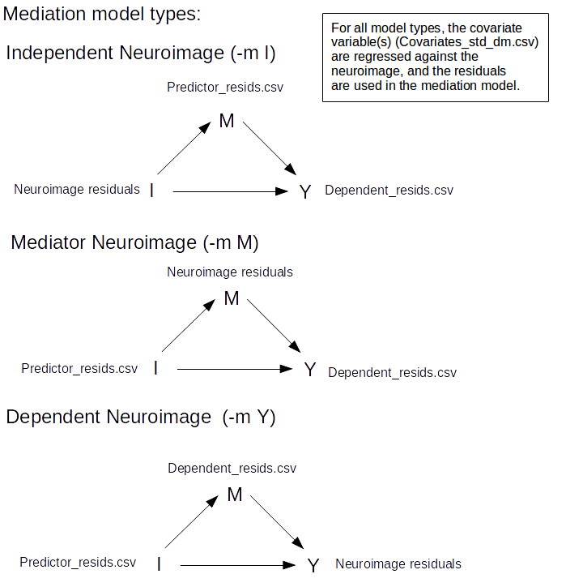

# TFCE_mediation
Fast regression and mediation analysis of vertex or voxel MR data with TFCE


### Citation ###

[Lett TA, Waller L, Tost H, Veer IM, Nazeri A, Erk S, Brandl EJ, Charlet K, Beck A, Vollstädt-Klein S, Jorde A, Keifer F, Heinz A, Meyer-Lindenberg A, Chakravarty MM, Walter H. Cortical Surface-Based Threshold-Free Cluster Enhancement and Cortexwise Mediation. Hum Brain Mapp. 2017 March 20. DOI: 10.1002/hbm.23563](http://onlinelibrary.wiley.com/doi/10.1002/hbm.23563/full)

The pre-print manuscript is available [here](tfce_mediation/doc/Lett_et_al_2017_HBM_Accepted.pdf) as well as the [supporting information](tfce_mediation/doc/Lett_et_al_2017_HBM_supporting_information.docx).

### What's new / updates ###

13-05-2017

* convert-surface now supports painting freesurfer label files to .ply files as well as outputing a legend. An example of the lh aparc atlas on the midthickness surface is: [left view](https://github.com/trislett/tm_addons/blob/master/4kRender/lh.aparc.annot_left_1080p.png), [right view](https://github.com/trislett/tm_addons/blob/master/4kRender/lh.aparc.annot_right_1080p.png), [legend](https://github.com/trislett/tm_addons/blob/master/4kRender/lh.aparc.annot_legend.png), and on the [Glasser et al.](http://www.nature.com/nature/journal/v536/n7615/abs/nature18933.html) lh of the HCP-MMC1 atlas: [left view](https://github.com/trislett/tm_addons/blob/master/4kRender/lh.HCP-MMP1.annot_left_1080p.png), [right view](https://github.com/trislett/tm_addons/blob/master/4kRender/lh.HCP-MMP1.annot_right_1080p.png), and a ridiculously long [legend](https://github.com/trislett/tm_addons/blob/master/4kRender/lh.HCP-MMP1.annot_legend.png)

05-05-2017

* convert-surface now supports exporting the [Polygon File Format (PLY)](https://en.wikipedia.org/wiki/PLY_(file_format)). Statistic files (*.mgh) can now be painted on the vertices with specifying a threshold range (e.g 0.95 1 for pFWE corrected images) with an either red-yellow or blue-lightblue color scheme (as well as all [matplotlib color schemes](https://matplotlib.org/examples/color/colormaps_reference.html)). So now you can 3D print your surface based results!
* A few examples of the high quality (3840x2160) render of painted results of the ?h.mean.area.00.mgh from 0.1mm to 1.0mm using the 'jet' colormap [right](https://github.com/trislett/tm_addons/blob/master/4kRender/MeanArea_transparent_right.png), [rostral](https://github.com/trislett/tm_addons/blob/master/4kRender/MeanArea_transparent_rostral.png), and [superior](https://github.com/trislett/tm_addons/blob/master/4kRender/MeanArea_transparent_superior.png). The surfaces were rendered using [Blender](https://www.blender.org/) and exported *.ply objects.
* A sample blender scene for making figures can be downloaded from [here](https://github.com/trislett/tm_addons/blob/master/BlenderScene/Sample_Scene.blend). n.b., when importing a new *ply object, the scale will need to be reduced. 
* wiki is slowly becoming alive

03-05-2017

* Added surface conversion tool (tm_tools convert-surface) for converting gifti / MNI objects / freesurfer .srf files to freesurfer .srf files for analysis with TFCE_mediation or waveform objects / Stl objects for importing the surface to 3D rendering software such as Blender or Meshlab. Among other things, this means that there is now full support for statistical analysis of neuroimages processed with CIVET. Here is an example of the midthickness surface [LH](https://github.com/trislett/tm_addons/blob/master/3dSurfaces/lh.midthickness.stl) and [RH](https://github.com/trislett/tm_addons/blob/master/3dSurfaces/rh.midthickness.stl).

02-05-2017

* Added fwhm_compute_distances_parallel to the misc_scripts directory. It is necessary for geodesic FWHM smoothing. 
* Full support for CIFTI-2 and GIFTI in the very near future.
* Version 1.1 is now available on pip 

21-04-2017

* Geodesic FWHM smoothing on the vertex images. It is performed on the midthickness surface. The runtime is approximately 4 minutes per image, but it can probably be faster. No more fudge factors!
* FWHM smoothing on voxel images.
* Too many additions to tm_maths than can be listed. Some examples are surface-based ICA artefact removal, curve fitting for calculation of the max TFCE null distribution of FWE correction, pca compression smoothing, many clustering algorithms, and powerful normalization tools. Check the help function.
* Initial support for CIVET vertex-based analyses (see the issues section)
* Version 1.1 will be pushed to pip in the near future. 


### Dependencies ###

TFCE_mediation should work with any UNIX based system. It has been tested on Ubuntu 14.04 and 16.04, Arch Linux, and OSX   
   
Required   
   
* [Freesurfer](https://surfer.nmr.mgh.harvard.edu/fswiki) (for vertex-based analyses)

Recommended

* [FSL](http://fsl.fmrib.ox.ac.uk/fsl/fslwiki)
* [Neurodebian repository](http://neuro.debian.net/)
* [PIP](https://pip.pypa.io/en/stable/installing/)

Recommended for parallelization:

* [GNU Parallel](http://www.gnu.org/software/parallel/)

or

* For personal installation of [HTCondor](https://research.cs.wisc.edu/htcondor/) (i.e., Condor), you can follow the instructions [here](http://neuro.debian.net/blog/2012/2012-03-09_parallelize_fsl_with_condor.html)

### Installation ###


PIP Install (recommended) The python dependencies will automatically be installed.
```
sudo pip install tfce-mediation
```
OR 

Install from source (requires the following python packages: numpy, scipy, matplotlib, nibabel, cython, scikit-learn, joblib):

```
git clone https://github.com/trislett/TFCE_mediation.git
cd TFCE_mediation
sudo python setup.py install
```

### Example work-flow for vertex regression analyses ###

1) Run standard [Freesurfer](https://surfer.nmr.mgh.harvard.edu/fswiki) (for vertex-based analyses) recon-all preprocessing of T1-weighted images.

2) Spherical registration


```
tfce_mediation step0-vertex -i subjectslist.csv area -p
```

Explanation:
Perform a spherical surface registration for each subject to the fsaverage resampling either area or thickness.

Inputs:
* subjectslist.csv (a text file contain one column of subject IDs. Note, the IDs must match those in the $SUBJECTS_DIR folder.)
* area (the surface to include in the analysis. For basic use, this should be area or thickness)

Outputs:
* ?h.all.area.00.mgh (all subjects to the fsaverage template using spherical registration)
* ?h.all.area.03B.mgh (the above file after 3mm FWHM smoothing of the surface)

3) Optional: Box-Cox transformation

```
tm_tools vertex-box-cox-transform -i lh.all.area.00.mgh 8
tm_tools vertex-box-cox-transform -i rh.all.area.00.mgh 8

# replace the ?h.all.area.03B.mgh with ?h.all.area.03B.boxcox.mgh
for i in lh rh; do
	mv ${i}.all.area.03B.mgh ${i}.all.area.03B.backup.mgh;
	mv ${i}.all.area.03B.boxcox.mgh ${i}.all.area.03B.mgh;
done
```

Explanation:
It has been suggested that surface area follows roughly a lognormal distribution [(Winkler, et al., 2012)](https://surfer.nmr.mgh.harvard.edu/ftp/articles/2012/2012_-_Winkler_et_al._-_NeuroImage.pdf); therefore, vertex-box-cox-transform normalizes the unsmoothed images using a power transformation (Box-Cox) transformation.

Inputs:
* ?h.all.area.00.mgh (The unsmoothed concatenated surface area image for subjects included)
* 8 (The number of processors to use)

Outputs:
* ?h.all.area.00.boxcox.mgh (Box-Cox transformed image)
* ?h.all.area.03B.boxcox.mgh (Box-Cox transformed image after 3mm FWHM smoothing)

4) Optional: orthonormalizing the regressors

```
tm_tools regressor-tools -i predictors.csv covariates.csv -o -s
```

Explanation:
For the two-step multiple regression and mediation analyses using TFCE_mediation, it is recommended to scale (or orthonormalization) the regressors. The input file(s) should be [dummy coded](http://www.ats.ucla.edu/stat/mult_pkg/faq/general/dummy.htm), and comma deliminated. The program returns either the orthogonalization of the input file(s) or it returns the residuals from a least squares regression to remove the effect of covariates from variable. In this example, we using the orthonormalization option (-o -s).

Inputs:
* predictors.csv (dummy-coded regressors of interest)
* covariates.csv (dummy-coded regressors of no interest)

Outputs:
* predictors_orthogonized.csv (orthogonormalized regressors of interest)
* covariates_orthogonized.csv (orthogonormalized regressors of no interest)

5) Multiple Regression

```
tfce_mediation step1-vertex-regress -i predictors_orthogonized.csv covariates_orthogonized.csv -s area
```

Explanation:
A two-step multiple regression is performed, and the resulting T-statistic images then undergo TFCE.

Inputs:
* predictors_orthogonized.csv (orthogonormalized regressors of interest)
* covariates_orthogonized.csv (orthogonormalized regressors of no interest)
* area (the surface of interest)

Outputs:
* python_temp_area/*.npy (Memory mapped numpy objects used later for permutation testing)
* output_area/tstat_area_?h_con?.mgh (t-statistic image or the respective hemispehere and contrast)
* output_area/negtstat_area_?h_con?.mgh (negative t-statistic image or the respective hemispehere and contrast)
* output_area/tstat_area_?h_con?_TFCE.mgh (TFCE transformed t-statistic image)
* output_area/negtstat_area_?h_con?_TFCE.mgh (TFCE transformed negative t-statistic image)
* output_area/max_TFCE_contrast_values.csv (The max TFCE value for the positive and negative contrast(s))

6) Permuation Testing (Randomization)

```
tfce_mediation step2-randomise-parallel --vertex area -n 10000 -p 8
```

Explanation:
Permutation testing using parallel processing. This script is a wrapper to make n=200 permution chunks, and parallelizing processing of the vertex-regress-randomise scipt for each chunk (in this case). i.e., each chunk to a different processor.

Input: 
* area (surface of interest)
* 10000 (total number of permutations)
* 8 (number of cores to used with GNU parallel)

Output:
* output/perm_Tstat_area/perm_tstat_con?_TFCE_maxVertex.csv (the maximum TFCE value among all vertices of the entire cortex for each permutation. It is used to correct for family-wise error)

7) Apply family-wise error rate correction

```
cd output
for i in lh rh; do 
	tfce_mediation vertex-calculate-fwep -i tstat_con1_area_${i}_TFCE.mgh perm_Tstat_area/perm_tstat_con1_TFCE_maxVertex.csv
	tfce_mediation vertex-calculate-fwep -i negtstat_con1_area_${i}_TFCE.mgh perm_Tstat_area/perm_tstat_con1_TFCE_maxVertex.csv
done
```
Explanation:
Calculate 1-P(FWE) vertex image from max TFCE values from randomisation. Note, the max TFCE values is determined from both the left and right hemisphere; therefore, there is only one max TFCE file per contrast. It is appropiate to use it correct the positive and negative t-statistic values from each hemisphere.

Input:
* tstat_area_?h_con?_TFCE.mgh (TFCE transformed T-statistic surface image)
* perm_tstat_con?_TFCE_maxVertex.csv (List with maximum TFCE values)

Output:
* tstat_area_?h_con?_TFCE_FWEcorrP.mgh (1-P(FWE) corrected image)

8) View results

```
tm_tools vertex-freeview-quick -i tstat_area_lh_con1_TFCE_FWEcorrP.mgh tstat_area_rh_con1_TFCE_FWEcorrP.mgh

```

### Example work-flow for voxel mediation analyses ###

1) Preprocess a 4D volume. For instance using [TBSS](http://fsl.fmrib.ox.ac.uk/fsl/fslwiki/TBSS/UserGuide). 

2) Load 4D volume into tfce_mediation


```
tfce_mediation step0-voxel -i 4dvolume.nii.gz mask.nii.gz
```

Explanation:
Load the 4D volume and its binarized mask into tfce_mediation

Inputs:
* 4Dvolume.nii.gz (3D NiFti volumes for all subjects. e.g. for TBSS output use all_FA_skeletonised.nii.gz)
* mask.nii.gz (binarized brain makes. e.g. for TBSS output use mean_FA_skeleton_mask.nii.gz)

Outputs:
* python_temp/*.npy (Numpy memory mapped objects used for all voxel analyses/actions)

3) Remove the effect of covariates on regressors for mediation analysis

```
tm_tools regressor-tools -i predictor_variable.csv covariates.csv -r -s
tm_tools regressor-tools -i dependent_variable.csv covariates.csv -r -s
```

Explanation:
For mediation analyses using TFCE_mediation, the effect of covariates should be removed from all regressors of interest. ‘regressor-tools -r’ returns the residuals after regressing out the effect of the covariates. In the next step (voxel-step1-????), the covariates will regressed out from the 4D_image.

Inputs:
* ?????_variable.csv (dummy-coded regressors of interest)
* covariates.csv (dummy-coded regressors of no interest)

Outputs:
* ?????_resids.csv (residuals of the variable of interest)
* covariates_std_dm.csv (unit variance and demean covariates file)

4) Mediation analysis

```
tfce_mediation step1-voxel-mediation -i predictor_resids.csv dependent_resids.csv -c covariates_std_dm.csv -m M
```
Explanation:
Mediation analyses using TFCE_mediation in which the ‘predictor_variable’ is the independent variable, the 4d_image is the mediator, and the ‘dependent_variable’ is the dependent variable. 

Inputs:
* ?????_resids.csv (residuals of the variable of interest)
* covariates_std_dm.csv (unit variance and demean covariates file)

Outputs:
* output_med_M/SobelZ_M.nii.gz (the untransformed Sobel Z-statistics of the indirect effect)
* output_med_M/SobelZ_M_TFCE.nii.gz (the TFCE transformed Z-statistics)
* output_med_M/maxTFCE_contrast_value.csv (the maximum TFCE values of the statistics image)


Note, different mediation models can be performed.



5) Permuation Testing (Randomization)

```
tfce_mediation step2-randomise-parallel --voxel -n 10000 -m M -p 8
```

Explanation:
Permutation testing using parallel processing. This script is a wrapper to make n=200 permution chunks, and parallelizing processing of the voxel-mediation-randomise scipt for each chunk (in this case). i.e., each chunk to a different processor.

Input: 
* M (mediation type)
* 10000 (total number of permutations)
* 8 (number of cores to used with GNU parallel)

Output:
* output_med_M/perm_SobelZ/perm_Zstat_TFCE_maxVoxel.csv (the maximum TFCE value among all voxels of the entire cortex for each permutation. It is used to correct for family-wise error)

6) Apply family-wise error rate correction

```
cd output_med_M
tfce_mediation voxel-calculate-fwep -i  SobelZ_M_TFCE.nii.gz  perm_SobelZ/perm_Zstat_TFCE_maxVoxel.csv
```
Explanation:
Calculate 1-P(FWE) voxel image from max TFCE values from randomisation.

Input:
* SobelZ_M_TFCE.nii.gz (TFCE transformed Z-statistic voxel image)
* perm_Zstat_TFCE_maxVoxel.csv (List with maximum TFCE values)

Output:
* SobelZ_M_TFCE_FWEcorrP.nii.gz (1-P(FWE) corrected image)

7) View results

Use your favorite viewer. e.g., fslview, mricron, MRIcroGL, etc.
